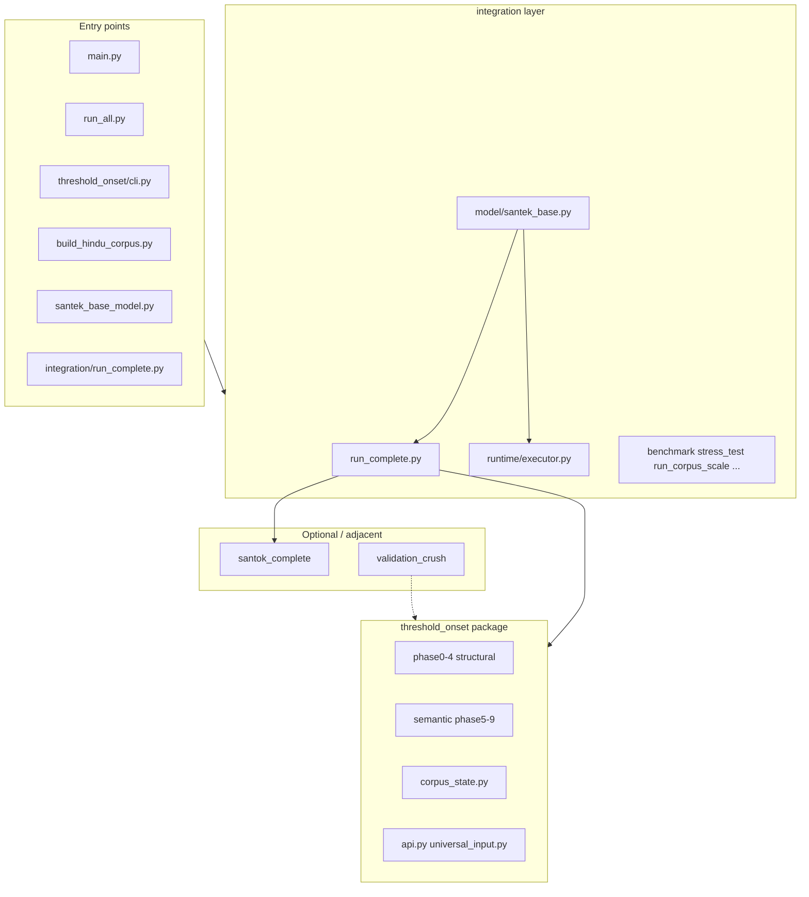
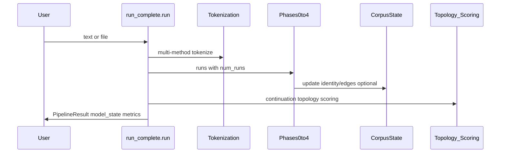

# Full codebase architecture (THRESHOLD_ONSET — current directory)

Authoritative map of this repository: entry points, the `threshold_onset` core package (phases 0–9), the `integration` orchestration layer (including `run_complete` and SanTEK), supporting subsystems, and data flow. Paths are relative to the repo root.

---

## High-level layers

---

## 1. Repository layout (physical)

| Area | Role |
|------|------|
| [`threshold_onset/`](../../threshold_onset/) | Installable package: **Phases 0–4** (action, segmentation, identity, relation, symbol), **semantic phases 5–9**, `corpus_state`, config, logging, enterprise CLI |
| [`integration/`](../../integration/) | **Unified pipeline** (`run_complete.py`), experiments, scoring/generation helpers, **SanTEK** (`model/santek_base.py`), **parallel runtime** (`runtime/`) |
| [`santok_complete/`](../../santok_complete/) | Optional SanTOK tokenizer stack; `run_complete` tries to import for tokenization |
| [`validation_crush/`](../../validation_crush/) | Separate intrinsic validation protocol (tests, crush_protocol) |
| [`data/`](../../data/) | Raw/clean corpora, `hindu_corpus_real.jsonl`, caches |
| [`config/default.json`](../../config/default.json) | Pipeline, model, corpus state paths, stability params |
| [`output/`](../../output/) | `corpus_state.json`, `santek_base_model.json`, logs, run artifacts |
| [`tests/`](../../tests/) | Pytest for corpus_state, runtime executor, phases, model API |
| [`scripts/`](../../scripts/) | Perf gates, cleaners, helpers |
| [`docs/`](../../docs/) | Deployment, API, observations, this architecture |
| [`versions/`](../../versions/), [`archive/`](../../archive/) | Snapshots / reference material (not primary runtime) |

---

## 2. Core package: `threshold_onset`

**Structural pipeline (frozen design per root README):**

- **Phase 0** — [`threshold_onset/phase0/`](../../threshold_onset/phase0/) — action → residue, trace, repetition
- **Phase 1** — [`threshold_onset/phase1/`](../../threshold_onset/phase1/) — boundaries / segmentation (distance, cluster, boundary)
- **Phase 2** — [`threshold_onset/phase2/`](../../threshold_onset/phase2/) — identity persistence across runs
- **Phase 3** — [`threshold_onset/phase3/`](../../threshold_onset/phase3/) — relations / graph
- **Phase 4** — [`threshold_onset/phase4/`](../../threshold_onset/phase4/) — symbol aliasing

**Semantic / downstream (phases 5–9)** — under [`threshold_onset/semantic/`](../../threshold_onset/semantic/) — consequence field, meaning, constraints, fluency, scoring, decoder paths used by richer flows.

**Cross-cutting:**

- [`threshold_onset/corpus_state.py`](../../threshold_onset/corpus_state.py) — corpus-level identity stability + edge weights; persisted to `output/corpus_state.json` when `CorpusManager` in [`integration/run_complete.py`](../../integration/run_complete.py) is enabled
- [`threshold_onset/cli.py`](../../threshold_onset/cli.py) — `threshold-onset` subcommands → subprocess to `integration/run_complete.py` / `integration/run_user_result.py`
- [`threshold_onset/api.py`](../../threshold_onset/api.py), [`threshold_onset/universal_input.py`](../../threshold_onset/universal_input.py) — programmatic surfaces

---

## 3. Integration hub: `run_complete.py`

[`integration/run_complete.py`](../../integration/run_complete.py) is the **single orchestrator** for the “complete unified pipeline” (documented in its module header): config (`PipelineConfig`), tokenization strategies, multi-run structure emergence (Phases 0–4), continuation observation, escape topology, clustering, path scoring, surface mapping, optional generation — plus **CorpusManager** hooks to load/save corpus state.

**Typical flow:**

Downstream scripts ([`integration/main_complete.py`](../../integration/main_complete.py), [`integration/structural_prediction_loop.py`](../../integration/structural_prediction_loop.py), etc.) compose the same ideas for demos or experiments.

---

## 4. SanTEK base model stack

| Component | File | Responsibility |
|-----------|------|------------------|
| User-facing CLI | [`santek_base_model.py`](../../santek_base_model.py) | `train` / `generate` / `chat` / `eval` / `info`; loads corpus from config or args |
| Implementation | [`integration/model/santek_base.py`](../../integration/model/santek_base.py) (active code from ~line 630) | **v4 engine**: `_run_pipeline_all_methods` → merged model state → symbol sequences + additive path_scores + vocab → `santek_train()` (ASD per-text) → `output/santek_base_model.json` |
| Parallel init | [`integration/runtime/executor.py`](../../integration/runtime/executor.py) | `ProcessPoolExecutor` + `JobSpec` / `JobResult` for per-text workers (`SANTEK_TEXT_WORKERS`, etc.) |
| Legacy SLE demo | [`santek_sle.py`](../../santek_sle.py) | Earlier SanTEK-SLE standalone script (v3 narrative); conceptually related but not the same entry as `santek_base_model.py` |

**SanTEK training data flow:**

---

## 5. Hindu corpus pipeline

[`build_hindu_corpus.py`](../../build_hindu_corpus.py) — **data acquisition + optional train**: download/clean → `data/hindu_corpus_real.jsonl` → dynamically imports `santek_base_model.py` and calls `cmd_train()` with the text list.

---

## 6. Other entry / orchestration paths

- [`main.py`](../../main.py) — menu / `--check` / `--user`; runs a **fixed list** of integration scripts ending with `run_complete.py` (`PIPELINE_STEPS` in that file)
- [`run_all.py`](../../run_all.py) — alternate full-project runner
- [`run_and_log.py`](../../run_and_log.py) — runs commands and appends to `execution_log.txt`
- [`integration/run_corpus_scale.py`](../../integration/run_corpus_scale.py), [`integration/run_corpus_stress.py`](../../integration/run_corpus_stress.py) — scale/stress with **their own** checkpoint JSON under `output/` (separate from SanTEK init checkpointing)

---

## 7. Configuration and environment

- **File:** [`config/default.json`](../../config/default.json) — `pipeline`, `santek_base_model`, `corpus.state_path`, etc.
- **Env overrides:** Documented in root README and [`docs/EXECUTION.md`](../EXECUTION.md) — e.g. `THRESHOLD_ONSET_NUM_RUNS`, `SANTEK_TRAIN_FAST`, `SANTEK_TEXT_WORKERS`, `PHASE1_SKIP_DISTANCES`, etc.

---

## 8. Dependencies philosophy

- **Core path:** stdlib-first; optional `rich` TUI in `run_complete`; optional `santok_complete` for tokenizers.
- **Packaging:** `pyproject.toml` / `setup.py` — exposes `threshold-onset` console script → `threshold_onset/cli.py`.

---

## 9. Summary mental model

1. **`threshold_onset`** — theory + phase implementations + corpus memory + enterprise CLI glue.
2. **`integration/run_complete.py`** — end-to-end **one text / one file** through tokenization → structure → topology → scoring → optional generation, with corpus persistence.
3. **`integration/model/santek_base.py` + `santek_base_model.py`** — **corpus-scale** structural learning: many texts, multi-method pipeline, merge, ASD training, JSON model.
4. **`build_hindu_corpus.py`** — domain-specific corpus build feeding (3).
5. **`validation_crush`**, **`santok_complete`**, **`scripts`**, **`versions`/`archive`** — satellites around the same structural ideas.

---

## Related docs

- [README.md in this folder](README.md) — index for architecture docs
- [Semantic subsystem](../../threshold_onset/semantic/ARCHITECTURE.md) — phase 5–9 layout inside the package
- [Root README](../../README.md) — quick start and CLI
