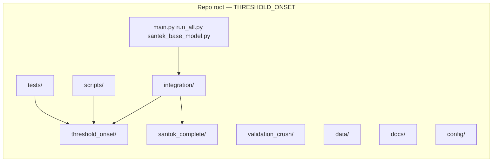
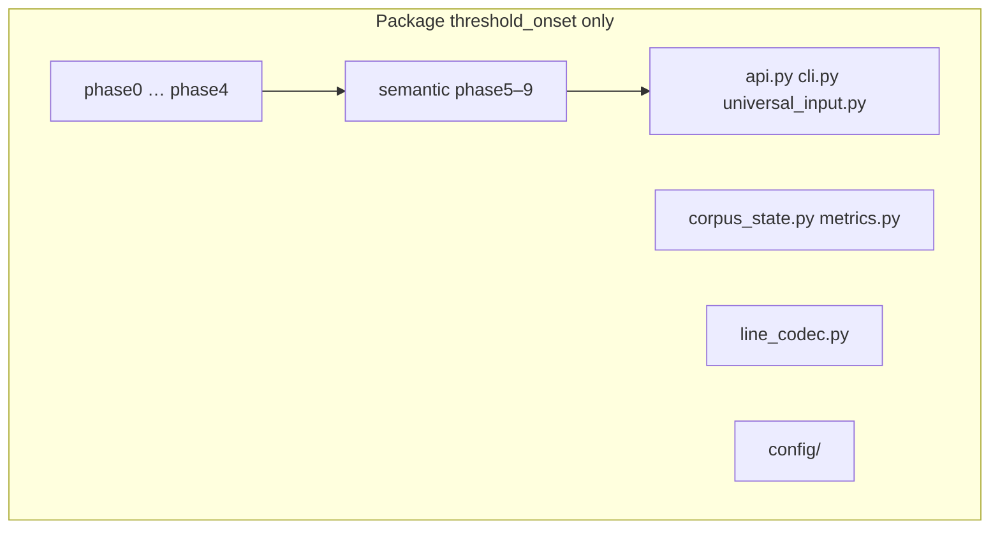

# Full architecture — two scopes (read this first)

This project confuses people because **two different things** share similar names:

| Scope | What it is | Typical path on your machine |
|--------|------------|------------------------------|
| **A. Repository root** | The **entire Git repo** — all top-level folders (`integration/`, `data/`, `scripts/`, `santok_complete/`, `docs/`, `tests/`, `main.py`, …) | `...\THRESHOLD_ONSET - Copy\` |
| **B. Python package `threshold_onset`** | **Only the installable package** — one subdirectory of the repo | `...\THRESHOLD_ONSET - Copy\threshold_onset\` |

**Understood:** the repo is **not** equal to the `threshold_onset` folder. The package lives **inside** the repo, alongside many other systems.

---

## A. Repository root (full monorepo)

Everything under the repo root is **one workspace**. Rough roles:

| Top-level path | Role |
|----------------|------|
| `threshold_onset/` | Core **library** (phases + semantic + API); see section B |
| `integration/` | **Orchestration**: `run_complete.py`, SanTEK `model/santek_base.py`, `runtime/`, experiments |
| `santok_complete/` | SanTOK tokenizer subsystem (optional import from integration) |
| `validation_crush/` | Separate validation / red-team style protocol |
| `data/` | Corpora, samples, optional submodule paths (not all data is committed) |
| `config/` | Shared JSON config (e.g. `default.json`) |
| `scripts/` | CLI tools (health server, perf, diagnostics) |
| `tests/` | Pytest suite for package + integration surfaces |
| `docs/` | All documentation, including this file |
| `main.py`, `run_all.py` | Legacy / convenience entry points |
| `santek_base_model.py` | Top-level SanTEK CLI entry |
| `build_hindu_corpus.py` | Corpus build pipeline |
| `pyproject.toml`, `setup.py` | Packaging; `pip install -e .` installs **`threshold_onset`** from this tree |

**Mental model:** Think **“monorepo”** — one Git clone, many subprojects. The **pip-installable name** is `threshold-onset`, but the **repo** contains far more than that package folder alone.

---

## B. Package `threshold_onset/` (inside the repo)

This directory is the **`threshold_onset` Python package** (import `import threshold_onset` / `from threshold_onset.api import ...`). It is **not** the whole repository.

| Under `threshold_onset/` | Role |
|--------------------------|------|
| `phase0/` … `phase4/` | Structural pipeline (action → symbol); frozen design per project rules |
| `semantic/` | Phases 5–9: consequence field, clustering, roles, constraints, fluency, tests |
| `api.py` | Programmatic `process()` and related surfaces for embedding |
| `cli.py` | `threshold-onset` console commands |
| `universal_input.py` | Input normalization |
| `corpus_state.py` | Corpus-level state (used with integration / persistence) |
| `line_codec.py` | Compact line-oriented encoding for logs / health payloads |
| `config/` | Package config loading |
| `tools/` | Version-control helpers for the package |
| `__main__.py` | `python -m threshold_onset` |

**Mental model:** This is the **core library**. **`integration/`** wires it to SanTEK, tokenizers, long runs, and file I/O at the **repo** level.

---

## How A and B connect

1. **Imports:** Code in `integration/` imports `threshold_onset.phase*`, `threshold_onset.semantic.*`, `threshold_onset.api`, etc.
2. **Runs:** You often start from **repo** scripts (`python integration/run_complete.py`, `python main.py`) — those are **not** inside `threshold_onset/` but they **call into** it.
3. **Tests:** `tests/` at repo root imports the **package**; the package does not contain all tests.

---

## Deeper detail

- **Same directory, more layers:** [ARCHITECTURE.md](ARCHITECTURE.md) — full codebase map, `run_complete`, SanTEK, data flow.
- **One way to run & verify:** [GOLDEN_PATH.md](GOLDEN_PATH.md).
- **Semantic internals:** [../../threshold_onset/semantic/ARCHITECTURE.md](../../threshold_onset/semantic/ARCHITECTURE.md).

---

## One-line summary

- **Repo root** = entire project tree you cloned.  
- **`threshold_onset/`** = the core Python package only; the rest of the repo is orchestration, data, tokenizers, docs, and tooling **around** that package.
