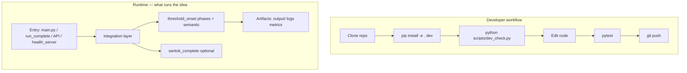
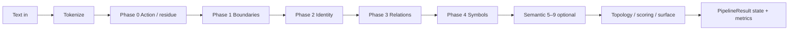
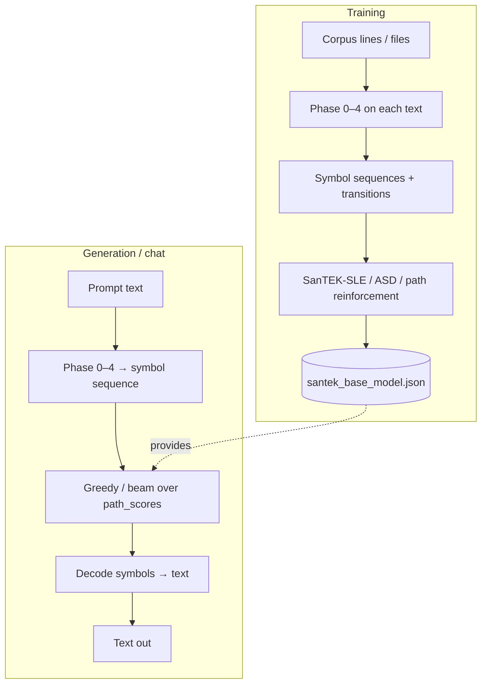
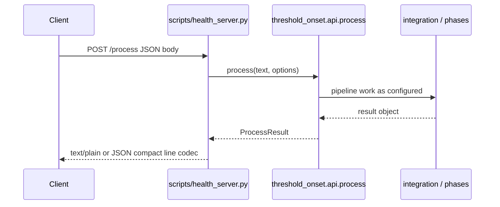
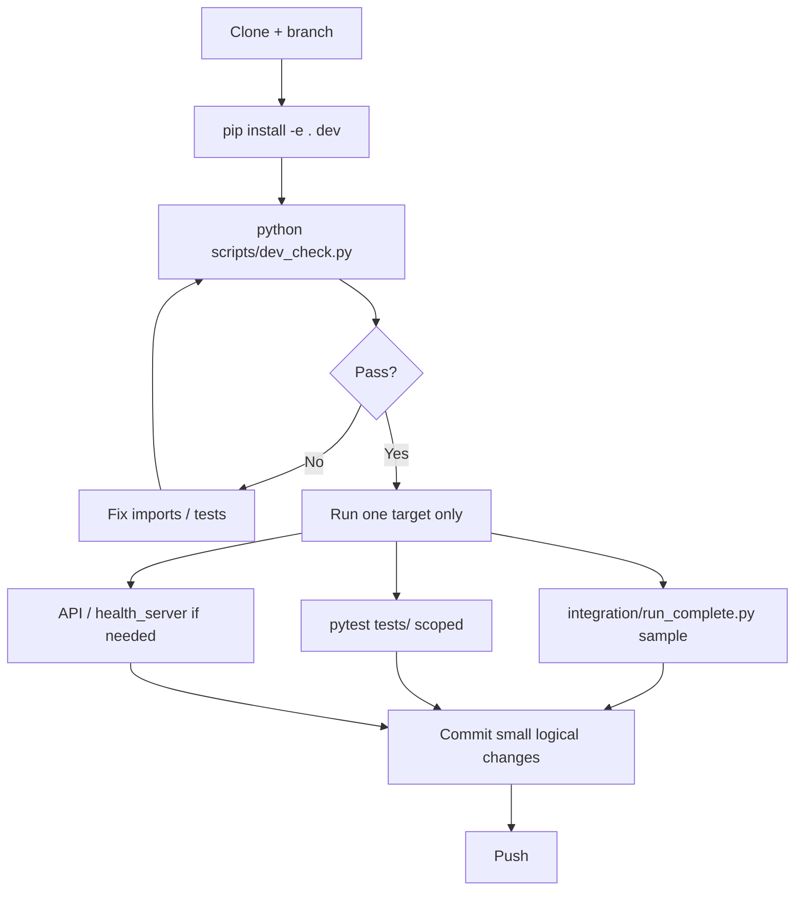

# Architecture workflow & process

This page is the **“how it works”** view — similar in spirit to **transformer / NN block diagrams** (boxes and arrows), but matched to **this** codebase: structural phases + SanTEK learning, **not** a generic PyTorch transformer tutorial.

---

## 1. Analogy: classic ML diagram vs this project

| Typical deep-learning diagram | In THRESHOLD_ONSET (what actually exists) |
|------------------------------|-------------------------------------------|
| Input tensor | **Text** (string or file) |
| Embedding layer | **Tokenization** (SanTOK / strategies in `run_complete`) |
| Stack of layers | **Phases 0–4** (structural) then **semantic 5–9** (when used in a flow) |
| Forward pass | **Pipeline run** — residues, boundaries, identity, relations, symbols |
| Loss + backprop | **Not** standard gradient descent on neural weights. **SanTEK-SLE** updates **path scores / structural state** (see `santek_base_model.py`, `integration/model/santek_base.py`) |
| Checkpoint | **`output/`** JSON / `santek_base_model.json` style artifacts |
| Inference | **GEN / CHAT / API** — prompt → pipeline → symbol sequence → extend via path scores → decode to text |

So: think **structural pipeline + learned transition statistics**, not “one big differentiable transformer.”

---

## 2. Big picture: repo vs runtime

---

## 3. Core processing pipeline (conceptual)

**Orchestrator:** `integration/run_complete.py` ties tokenization, phases, topology/scoring, optional generation.

**Package home for phases:** `threshold_onset/phase0` … `phase4`, `threshold_onset/semantic/`.

---

## 4. SanTEK base model: train → save → generate

High-level flow as described in `santek_base_model.py`:

**Note:** This is **structural + learned scores on transitions**, not “attention softmax × V” in the Transformer sense.

---

## 5. How requests reach code (API / HTTP)

**Compact encoding:** `threshold_onset/line_codec.py` used for logs / health payloads.

---

## 6. Clean development process (recommended)

**Rule of thumb:** one entry point per debugging session (`run_complete` *or* `main.py` *or* API), so you do not mix five stories at once.

---

## 7. Where to read more

| Topic | Doc |
|-------|-----|
| Repo vs `threshold_onset/` package | [FULL_ARCHITECTURE.md](FULL_ARCHITECTURE.md) |
| Deep codebase map, `run_complete`, SanTEK files | [ARCHITECTURE.md](ARCHITECTURE.md) |
| Install + smoke commands | [GOLDEN_PATH.md](GOLDEN_PATH.md) |
| Semantic layers 5–9 | [../../threshold_onset/semantic/ARCHITECTURE.md](../../threshold_onset/semantic/ARCHITECTURE.md) |

---

## Rendering

GitHub renders **Mermaid** in Markdown automatically. In VS Code, use a Mermaid preview extension if you want the same diagrams locally.
